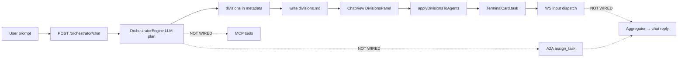

# Composer Audit Report — AI Orchestrator Platform

**Generated:** 2026-05-27 (expanded)  
**Scope:** Full repository audit for production readiness after IBM BOB → Orchestrator refactor  
**Excluded from detailed review:** `downloader_page/` (per project directive — noted separately in §12)  
**Intent:** Find every major-to-minute bug, corner case, and inconsistency. **No fixes applied** — implement later using issue IDs below.

---

## 1. Executive summary

The platform is in a **transitional state**: a new modular orchestrator stack exists (`backend/services/orchestrator/`, `providers/`, `agents/`, `tools/`) but **legacy layers, docs, and installer pipelines remain**. Dev workflow (`python run.py` + `frontend/`) can work, but **production readiness is blocked** by authentication gaps, DB bootstrap gaps, dual encryption paths, UI/API drift, and broken installer build scripts.

| Severity | Approx. count | Top themes |
|----------|---------------|------------|
| **Critical** | 8 | No real auth, DB not auto-init on startup, dual encryption, terminal grid spawns orchestrator LLMs as CLIs |
| **High** | 45 | Orchestrator settings not wired, onboarding disables LLMs, mock UI data, installer paths wrong, ~40% of API surface unused by UI |
| **Medium** | 49 | Dead legacy services, race conditions, session lifecycle drift, PTY orphans, incomplete planning loop |
| **Low** | 28 | Branding remnants, dead deps, report discoverability |

**Recommended fix order:** §3 → Security/auth → DB init → Encryption unification → Frontend/API alignment → Installer/docs cleanup → Dead code removal.

---

## 2. Audit scope & methodology

### 2.1 Areas reviewed

| Area | Path(s) | Status |
|------|---------|--------|
| Backend API | `backend/api/routes/`, `websockets/` | Full |
| Backend services | `backend/services/` (new + legacy) | Full |
| Database | `backend/database/`, `migrations/`, `data/` | Full |
| Config / entry | `backend/config.py`, `main.py`, `run.py` | Full |
| Frontend app | `frontend/src/app/` | Full |
| Frontend tooling | `vite.config.ts`, `package.json` | Partial |
| Installer / release | `release/installer/` | Full |
| Documentation | `docs/`, `README.md` | Full |
| Shared assets | `shared/` | Partial |
| Session archive | `IBMBOB sessions/` | Noted (noise only) |
| Downloader | `downloader_page/` | **Excluded** (§12) |

### 2.2 Method

- Static code review across all modules above  
- Cross-check frontend API calls vs backend routes/models  
- Verify refactor remnants (IBM/Watson/BOB) via search  
- Import smoke test: `from backend.main import app` (passes at audit time)  
- **Not run:** full E2E browser tests, load tests, security penetration tests  

---

## 3. Priority fix roadmap

### Phase 0 — Blockers (do first)

1. **CRIT-001** — Implement real auth; remove spoofable `user_id` query param  
2. **CRIT-002** — Auto-run DB init/migrations in `main.py` lifespan  
3. **CRIT-003** — Unify credential encryption (single Fernet path)  
4. **CRIT-004** — Filter orchestrator LLMs out of terminal/PTY grid (`App.tsx`)  
5. **CRIT-005** — Wire Settings orchestrator panel ↔ `/api/orchestrator/config`  
6. **CRIT-006** — Fix onboarding disabling Grok/Gemini/DeepSeek orchestrator providers  
7. **CRIT-007** — Require stable `ENCRYPTION_KEY` in production (fail fast)  
8. **CRIT-008** — Fix installer PyInstaller paths (`backend/app` → `backend.main`)

### Phase 1 — Security hardening

- WebSocket auth (**HIGH-001**), session ownership (**HIGH-002**), runtime scoping (**HIGH-003**), MCP path sandbox (**HIGH-004**), git run restrictions (**HIGH-005**)

### Phase 2 — Functional completeness

- Chat loads session history (**MED-001**), agent delegation wired (**HIGH-006**), remove/replace mock graph (**HIGH-007**), lazy PTY spawn (**HIGH-008**)

### Phase 3 — Cleanup & docs

- Delete legacy `*_service.py` layer or wire it (**MED-002**), rewrite `docs/QUICK_START.md` + `docs/API.md` (**HIGH-009**), consolidate installer pipeline (**CRIT-008** continuations)

---

## 4. Severity legend

| Level | Meaning |
|-------|---------|
| **Critical** | Data loss, security breach, app unusable on fresh install, or core feature completely broken |
| **High** | Major feature wrong/misleading, significant security weakness, or production deploy blocker |
| **Medium** | Partial breakage, confusing UX, tech debt causing future bugs |
| **Low** | Cosmetic, docs, naming, minor edge cases |

Each issue: **ID · Severity · Location · Problem · Recommended fix**

---

## 5. Critical issues

### CRIT-001 — Authentication is a stub; user impersonation possible
- **Location:** `backend/api/dependencies.py:72-82`
- **Problem:** `get_current_user_id(user_id: Optional[int] = None)` exposes `user_id` as a FastAPI **query parameter**. Any client can call `?user_id=2` and access another user's sessions, credentials, workspace, analytics.
- **Fix:** Remove the parameter entirely. Return identity from JWT/session only. Until implemented, hardcode `return 1` and document single-user mode.

### CRIT-002 — Database schema not initialized on app startup
- **Location:** `backend/main.py` lifespan (~58-64); `backend/database/init_db.py` (full init exists but unused at runtime)
- **Problem:** Fresh clone: `aiosqlite.connect()` succeeds on empty/missing tables → all API calls fail until manual `python run.py --init-db` or `init_db.py`.
- **Fix:** Call `init_database(str(settings.database_path))` (or equivalent) during lifespan startup before accepting traffic.

### CRIT-003 — Two incompatible credential encryption implementations
- **Location:** `backend/utils/credentials.py` vs `backend/services/encryption_service.py`; routes use前者, legacy `ProviderService` uses后者
- **Problem:** Credentials encrypted via API may be undecryptable by legacy service and vice versa. Formats differ (plain Fernet vs PBKDF2+salt).
- **Fix:** Single module (`utils/credentials.py` or `encryption_service.py`); migrate existing DB rows; delete duplicate.

### CRIT-004 — Frontend spawns PTY terminals for orchestrator LLM providers
- **Location:** `frontend/src/app/App.tsx:255` — `.filter(p => p.is_enabled && p.provider_type === "llm")`
- **Problem:** Backend marks `grok`, `gemini-api`, `deepseek-api`, `openai`, etc. as `provider_type: "llm"`. UI creates terminal cards and spawns shells for **API-only orchestrator models**, not CLI agents.
- **Fix:** Whitelist CLI agent ids (`claude`, `gemini`, `codex`, …) or exclude `config_schema.role === "orchestrator"` / names in `ORCHESTRATOR_LLM_NAMES`.

### CRIT-005 — Orchestrator UI settings do not affect backend routing
- **Location:** `frontend/src/app/components/store.tsx` (prefs → `/api/settings`); `frontend/src/app/components/Settings.tsx` Orchestrator panel; backend reads `orchestrator_config` table + `OrchestratorEngine`
- **Problem:** Model, routing strategy, parallelism, caps sync to `user_preferences` only. `/api/orchestrator/chat` ignores them. User changes Settings → no effect on chat behavior.
- **Fix:** Read/write `/api/orchestrator/config`; map UI enums to backend `RoutingStrategy`; pass `model_name` on chat POST.

### CRIT-006 — Onboarding disables orchestrator LLM providers when not selected
- **Location:** `backend/api/routes/onboarding.py:260-264`
- **Problem:** Loop sets `is_enabled=0` for **every** unselected provider. User picks only CLI tools → Grok/Gemini/DeepSeek disabled → orchestrator has no LLM.
- **Fix:** Never disable orchestrator LLM rows from CLI selection; separate toggles for "CLI agents" vs "orchestrator LLM".

### CRIT-007 — Ephemeral encryption key when `ENCRYPTION_KEY` unset
- **Location:** `backend/utils/credentials.py:36-38`
- **Problem:** New random Fernet key each process start → all stored API keys become undecryptable after restart.
- **Fix:** Fail startup in production if missing; installer must write stable key to user-data dir.

### CRIT-008 — Installer PyInstaller targets non-existent `backend/app`
- **Location:** `release/installer/backend/build_backend.py`, `pyinstaller.spec`, packaged `main.py`
- **Problem:** Build resolves `project_root` to `release/` not repo root; expects `release/backend/app/`. Actual entry: `backend/main.py`, package `backend.*`.
- **Fix:** Repo root = `Path(__file__).resolve().parents[3]`; bundle `backend/`; entrypoint `backend.main:app`.

---

## 6. High severity — Security & access control

| ID | Location | Problem | Recommended fix |
|----|----------|---------|-----------------|
| HIGH-001 | `backend/api/websockets/terminals.py:43+` | `/ws/terminals/{runtime_id}` has **no auth** — anyone with runtime ID gets shell I/O | JWT/cookie on WS connect; verify runtime ownership |
| HIGH-002 | `backend/api/routes/orchestrator.py:478+` | Chat accepts arbitrary `session_id` without verifying `sessions.user_id` | Validate session belongs to current user before insert |
| HIGH-003 | `backend/api/routes/runtimes.py:106-108, 634+` | Runtimes with `session_id IS NULL` visible to all users; `verify_runtime_exists` has no user scope | Tie runtimes to user/session; filter list by owner |
| HIGH-004 | `backend/services/tools/mcp.py:73-80` | `workspace.list_files` accepts arbitrary `path` — directory traversal / info leak | Restrict to active workspace root |
| HIGH-005 | `backend/api/routes/workspace.py:230-287` | `/workspace/git/run` allows `push`, `commit`, `checkout` on server workspace | Narrow allowlist; require auth; consider read-only mode |
| HIGH-006 | `backend/api/routes/orchestrator.py` chat flow | Docstring says "delegates to CLI agents" but `CLIAgentAdapter`, `A2ABus`, `aggregator.py` **never called** | After plan, call `assign_task()` per division; optional aggregate |
| HIGH-007 | `frontend/.../OrchestratorGraph.tsx`, `AnalyticsStrip.tsx` | **Fully mocked** routing graph, CPU %, task counts — looks live | Wire to `/api/analytics/*` or label "Demo data" |
| HIGH-008 | `frontend/.../ProcessesView.tsx` + `TerminalCard.tsx` | **Every enabled agent spawns PTY on mount** — heavy; 501 on non-Windows | Lazy spawn on focus/expand; respect `parallelism` setting |
| HIGH-009 | `docs/QUICK_START.md`, `docs/API.md` | Document **downloader_page** API, not main orchestrator | Rewrite or split docs; point README to correct quick start |
| HIGH-010 | `frontend/.../Settings.tsx` credentials load | GET returns masked `api_key: "***"`; Save can POST `"***"` and **corrupt** credentials | Skip masked values on save; add `has_credentials` flag |
| HIGH-011 | `frontend/.../Onboarding.tsx` `finish()` | Optimistic `setWorkspace`/`setProviders` **before** API success | Update state only after `POST /onboarding/complete` OK |
| HIGH-012 | `frontend/.../Sidebar.tsx` | `remoteSessions.length > 0 ? remote : localSessions` — empty backend → **demo sessions** shown | Use remote only; empty state when no sessions |
| HIGH-013 | `backend/api/routes/orchestrator.py:174-186` | `/dispatch` inserts `session_id` nullable into **NOT NULL** column | Make column nullable or require session_id |
| HIGH-014 | `/orchestrator/dispatch` | Stub: picks provider, writes history, **never invokes LLM or agent** | Integrate engine or remove endpoint |
| HIGH-015 | `run.py:604-609` | Hardcodes `data/bob.db` in backend env, **ignores** `backend/.env` DATABASE_PATH | Reuse `_resolve_database_path_for_init()` for uvicorn env |
| HIGH-016 | `release/installer/launcher/launcher.py` | IBM branding, `%LOCALAPPDATA%\IBMBob`, `BOB_BUNDLED` only | Rename to Orchestrator; set `ORCHESTRATOR_*` env vars |
| HIGH-017 | Dual Windows pipelines | `setup.iss` (Orchestrator) vs `installer.iss` + `build.ps1` (IBM Bob) | Delete/consolidate to one pipeline |
| HIGH-018 | `backend/api/websockets/terminals.py` ask handler | WS `ask` uses **env keys only**; ignores DB credentials from Settings UI | Reuse `OrchestratorEngine.load_llm_configs()` |

---

## 7. High severity — Frontend / API mismatch

| ID | Location | Problem | Recommended fix |
|----|----------|---------|-----------------|
| HIGH-019 | `App.tsx` chat POST | Never sends `model_name` from store orchestrator config | Add `model_name: orchestrator.model` |
| HIGH-020 | `TerminalCard.tsx` | Full-screen opens `/terminal/${id}` — **no route** exists | Add route or in-app modal |
| HIGH-021 | `GlobalChatBar.tsx` | Attach disabled until `activeSessionId` set (after first reply) | Create session on first send or allow workspace attach |
| HIGH-022 | `App.tsx` hydration | Onboarding gate uses localStorage before backend hydration → **flash** wrong screen | Gate on `backendHydrated` flag from store |
| HIGH-023 | `ChatView.tsx` | "Re-route" button has **no handler** | Implement or remove |
| HIGH-024 | `TerminalCard.tsx:552` | UI still says **"Ask BOB"** | Rename to "Ask orchestrator" |
| HIGH-025 | `backend/api/routes/agents.py:45-47` | Lists **all** enabled providers as agents including grok/gemini-api | Exclude orchestrator LLM names (same as engine) |
| HIGH-026 | `ContextDropzone.tsx` / Settings context tab | Local/mock files; no upload to `/workspace/shared` | Wire upload + refresh from API |
| HIGH-027 | `README.md` | WebSocket path `/ws/runtimes/` — actual is `/ws/terminals/{id}` | Fix README architecture section |
| HIGH-028 | `release/installer/backend/requirements.txt` | Subset of deps — PyInstaller bundle would miss `aiosqlite`, `cryptography`, etc. | Generate from main `backend/requirements.txt` |

---

## 8. Medium severity — Backend logic & data

| ID | Location | Problem | Recommended fix |
|----|----------|---------|-----------------|
| MED-001 | `orchestrator.py` chat | `SharedContext` only has current message; **no DB history** loaded | Load last N messages from `messages` table |
| MED-002 | `backend/services/*_service.py` (~3500 LOC) | Sync SQLite services **unused** by any API route | Delete or migrate routes to use them |
| MED-003 | `orchestrator_service.py` | Legacy orchestrator exported but **dead** | Remove; update docs to `services/orchestrator/` |
| MED-004 | `api/dependencies.py` | Single global `aiosqlite` connection; no WAL on runtime conn | Enable WAL; consider per-request connections |
| MED-005 | `providers` GET | No auth; enablement is **global** in DB, credentials per-user | Document single-user model or add per-user prefs |
| MED-006 | `http_llm.py` / `gemini.py` health_check | Health probe runs **paid completion** ("ping") | Use models/list endpoint or cache |
| MED-007 | `gemini.py:128-132` | `stream()` falls back to full `complete()` — no true streaming | Implement Gemini stream API |
| MED-008 | `core.py:84-88` | Decrypt failure → use raw blob as API key | Fail loudly; don't send garbage to providers |
| MED-009 | `init_db.py` seeds | `openai`, `anthropic`, `google`, `ollama` seeded `is_enabled=1` without credentials | Default `is_enabled=0` for infra providers |
| MED-010 | `settings.py` cli-registry | 404 if `release/installer/bootstrapper/cli_registry.json` missing in some layouts | Ship default in backend or configurable path |
| MED-011 | `runtimes.py` approve endpoint | Checks `RUNNING` not pending-approval state | Implement approval state machine or remove |
| MED-012 | `onboarding.py` imports | `from backend.api.routes.providers import encrypt_credential` | Import from `utils/credentials` |
| MED-013 | `ChatRequest` schema | `stream`, `context_files`, `provider_id`, `metadata` **ignored** by chat route | Implement or remove from schema |
| MED-014 | `App.tsx` | `costByProvider.get(p.display_name)` — duplicate display names merge costs | Key by provider `name` slug |
| MED-015 | `App.tsx` | Provider poll failure → `setClis([])` wipes all cards | Keep last-good state; show degraded banner |
| MED-016 | `TerminalCard.tsx` | `term.onData` registered inside `ws.onopen` — reconnect **stacks handlers** | Register once; cleanup on unmount |
| MED-017 | `App.tsx` | No AbortController on chat — responses can land on wrong session after switch | Tag responses; cancel in-flight |
| MED-018 | `pty_service.py` + `runtimes.py` | Spawn race: DB row before PTY; cross-user PTY reuse via `active_for_provider` | User-scope PTY sessions |
| MED-019 | `websockets/terminals.py:78-89` | `ensure_future` on WS send after disconnect — orphaned tasks | Track connection lifecycle |
| MED-020 | `migrations/002_*.sql` | Disables `bob` provider — fresh installs never had `bob` | Document legacy-only migration |
| MED-021 | `migrations/001_cli_pty.sql` | Empty placeholder; PTY logic in Python `apply_migrations()` | Consolidate or document |
| MED-022 | `schema.sql:288` + dispatch | `routing_history.session_id NOT NULL` vs optional dispatch | Align schema and API |
| MED-023 | `shared/skill.md` vs installer templates | Claim PostgreSQL; app uses SQLite | Align templates with actual stack |
| MED-024 | `ProcessesView.tsx` | Copy: "ibm-cloud · custom agent" | Update branding |
| MED-025 | `store.tsx` | Demo sessions `demo-1`, `demo-2` in DEFAULT_STATE | Empty array for production |
| MED-026 | `Settings.tsx` | Shortcuts documented but not implemented in `App.tsx` | Implement or remove from UI |
| MED-027 | `VoiceButton.tsx` | Stale `partial` closure on `rec.onend` — empty transcript | Use ref for latest partial |
| MED-028 | `vite.config.ts` | Absolute `VITE_API_BASE` breaks WS host (still uses Vite port) | Derive WS URL from backend target |
| MED-029 | `cliInstall.ts` | Package names may not match real CLIs (`deepseek-cli`, etc.) | Verify against official install docs |
| MED-030 | `database_path` | Relative path depends on CWD | Resolve to absolute under user-data |
| MED-031 | `providers.py` | Unused imports (`Fernet`, `decrypt_credential`, etc.) | Clean up |
| MED-032 | `utils/exceptions.py` | `register_exception_handlers` never called from `main.py` | Wire or delete |
| MED-033 | `api/websockets/manager.py` | `ConnectionManager` unused | Remove or integrate |
| MED-034 | `orchestrator/aggregator.py` | Unused module | Wire into chat or delete |
| MED-035 | Sync + async SQLite | Legacy services use `sqlite3` while API uses `aiosqlite` on same file | Unify on async |

---

## 9. Medium severity — Infrastructure & installer

| ID | Location | Problem | Recommended fix |
|----|----------|---------|-----------------|
| MED-036 | `release/installer/windows/installer.iss` | Wrong relative paths (`..\..\..\..\backend`) | Fix or delete in favor of `setup.iss` |
| MED-037 | `release/installer/build.py` | References missing `macos/build_macos.sh` | Point to `create_dmg.sh` or add script |
| MED-038 | `setup.iss` | Missing `icon.ico`; `LicenseFile=..\LICENSE` wrong path | Add assets or fix paths to repo `LICENSE` |
| MED-039 | `docs/PROJECT_STRUCTURE.md` | References `backend/app/main.py`, wrong installer paths | Update to current layout |
| MED-040 | `release/installer/README.md` | Links to non-existent `docs/INSTALLATION.md`, wrong pip paths | Fix links and relative paths |
| MED-041 | `run.py` | Docstring still "IBM Bob - Main Entry Point" | Rebrand to AI Orchestrator |
| MED-042 | Env naming split | `ORCHESTRATOR_*` vs `BOB_*` / `IBMBOB_*` | Standardize; deprecate legacy aliases |
| MED-043 | `workspace.yaml.template` | Rate limit key `ibm-bob` | Replace with `grok` or remove |
| MED-044 | `shared/` | Missing `sessions/.gitkeep`, `plan.md` referenced in README | Add placeholders or update README |

---

## 10. Low severity — Branding, docs, cosmetic

| ID | Location | Problem | Recommended fix |
|----|----------|---------|-----------------|
| LOW-001 | `backend/database/schema.sql:1` | Header "IBM Bob Backend System" | Rename to AI Orchestrator |
| LOW-002 | Many `backend/services/*.py` docstrings | "IBM Bob Backend System" | Bulk update headers |
| LOW-003 | `backend/services/pty_service.py` | Exit message `[bob] process exited` | Use `[orch]` or provider name |
| LOW-004 | `OrchestratorGraph.tsx` | granite-3.2, ibm-cloud labels | Neutral labels + live data |
| LOW-005 | `Loader.tsx` | "Booting Orchestra" vs "Orchestrator" | Standardize naming |
| LOW-006 | `Onboarding.tsx` | "Orchestra" wording | Use Orchestrator consistently |
| LOW-007 | `Settings.tsx` About | Lists "BOB" as agent | Remove or replace with Grok |
| LOW-008 | `store.tsx` | `PROVIDER_BY_CLI_SLUG` missing `kimi` | Add slug mapping |
| LOW-009 | `TerminalCard.tsx` | Invalid prop `listWidth` on Dropdown | Remove prop |
| LOW-010 | `App.tsx` | Fixed 1.3s loader regardless of backend readiness | Tie to health + hydration |
| LOW-011 | `App.tsx` | No disable during chat send — double submit | Add loading state |
| LOW-012 | `Settings.tsx` | Decorative accent swatches, dead toggles | Wire or remove |
| LOW-013 | `Settings.tsx` | About links without `href` | Add URLs |
| LOW-014 | `Sidebar.tsx` | Collapsed settings uses Clock icon | Use Settings icon |
| LOW-015 | `store.tsx` | `prefs.sound` / `desktopNotifs` never trigger UI | Implement or mark future |
| LOW-016 | `requirements.txt` | `python-jose`, `passlib` unused (no auth) | Remove until auth implemented |
| LOW-017 | `requirements.txt` | `pystray`, `pillow` in backend reqs (tray is installer) | Move to installer requirements |
| LOW-018 | `.gitignore` | Footer "Made with Bob" | Remove |
| LOW-019 | `IBMBOB sessions/` (22 files) | Hackathon transcripts; pollutes search | Gitignore or move out of repo |
| LOW-020 | `data/bob.db` filename | IBM-era naming | Optional rename to `orchestrator.db` |
| LOW-021 | `main.py:75` | `asyncio.get_event_loop()` deprecated pattern | Use `get_running_loop()` |
| LOW-022 | Frontend | No committed `tsconfig.json` — weak type checking | Add strict TS config |

---

## 11. Corner cases & edge-case catalog

| Scenario | Expected | Actual | Fix ref |
|----------|----------|--------|---------|
| Fresh git clone, run `python run.py` without `--init-db` | App works | API 500s on missing tables | CRIT-002 |
| User configures API keys in Settings UI, uses terminal Ask | Uses stored keys | WS ask only reads env vars | HIGH-018 |
| User completes onboarding selecting Claude + Gemini CLI only | Orchestrator still has LLM | Grok/Gemini-API disabled | CRIT-006 |
| User saves credentials without changing key field | Keeps old key | May save `"***"` | HIGH-010 |
| Two users (future) same runtime_id | Denied | WS open to anyone | HIGH-001 |
| Chat with `session_id` of another user | 403 | Messages inserted | HIGH-002 |
| `/orchestrator/dispatch` without session_id | Works or clear error | SQLite IntegrityError | HIGH-013 |
| Windows dev with 6 enabled agents | Reasonable load | 6 PTYs spawn immediately | HIGH-008 |
| Non-Windows dev | Graceful degrade | 501 on every spawn | MED-018 + UX message |
| Backend down mid-chat | Error in UI | Hang until timeout (partially fixed with apiFetch) | Verify all fetch paths use timeout |
| Git status when backend offline | "waiting for backend" | Was "not a git repo" (partially fixed) | Confirm all git UI paths |
| Migration from pre-refactor DB with `bob` provider | Grok added, bob disabled | OK if 002 applied | Document upgrade path |
| `ENCRYPTION_KEY` rotated | Re-enter credentials | Old credentials lost (expected) | Document; backup key |
| Provider health check in loop | Cheap | Costs API $ per check | MED-006 |
| Double-click Dispatch in chat | One message | Possible duplicate sends | LOW-011 |
| Voice input end without manual stop | Full transcript | Often empty (stale closure) | MED-027 |
| File attach before first chat message | Should work | Blocked | HIGH-021 |
| VITE_API_BASE=http://127.0.0.1:8000/api | REST works | WS may hit wrong host | MED-028 |
| User sets routing to "specialty" or "cheapest" in Settings | Backend uses matching strategy | Stored in `user_preferences` only; backend expects `auto`/`least_cost` | HIGH-029, CRIT-005 |
| User configures `gemini-api` in DB but UI only shows `gemini` CLI | One key for orchestrator LLM | Two provider rows; UI can't configure orchestrator Gemini separately | HIGH-030 |
| User opens Session History tab | Shows real backend sessions | Uses **local Zustand store** only (`demo-1`, etc.) | HIGH-031 |
| User clicks "Clear" session history | Deletes from DB | Clears local store only; backend rows remain | HIGH-032 |
| User clicks sidebar session after new chat | Immediate list update | 15s poll delay before new session appears | MED-047 |
| User selects session with `paused` status | Shows paused | Sidebar maps non-completed → `active` | MED-048 |
| User archives session | Shows archived | Mapped to `failed` badge | MED-049 |
| Orchestrator returns 3 divisions for same agent | Queue or merge | `applyDivisionsToAgents` — last division wins | HIGH-043 |
| Agent finishes task in PTY | Division status → `done` in chat | Status never updated server-side or in UI | HIGH-044 |
| User attaches context file then chats | Files in LLM context | `context_files` never sent on POST | HIGH-041 |
| User checks Grok/Gemini health in Settings | Live connectivity | `/orchestrator/providers/health` never called | HIGH-034 |
| Backend restarts; frontend has stale runtime_id | Auto-respawn | WS fails; user must reload card manually | MED-055 |
| WS disconnect with zero clients | PTY torn down after grace period | PTY may run indefinitely | MED-045 |
| User opens full-screen terminal URL | Dedicated view | `/terminal/:id` — no route; blank Vite page | HIGH-020 |
| Settings fetch fails on slow network | Timeout error | Raw `fetch` hangs (no `apiFetch`) | HIGH-040 |
| Multi-tab: two browsers same runtime | Documented behavior | Both can send input; race on task dispatch | CC-35 |
| Chat response arrives after user switched session | Ignored or tagged | No AbortController; wrong session may update | MED-017 |
| Division agent id `claude` but card id from slug mismatch | Task assigned | Match fails; agent stays idle | HIGH-043 |
| User enables 8 CLI agents on Windows | Respects parallelism cap | 8 PTYs spawn immediately | HIGH-008 |
| Orchestrator plan with zero divisions | Clear empty state | Chat shows thinking only; Processes unchanged | CC-36 |
| `POST /workspace/context` before session exists | Queue upload | 400/404; attach blocked in GlobalChatBar | MED-052 |
| User saves settings while offline | Error toast | Silent failure; debounced PUT lost | CC-37 |
| Demo sessions in store when API returns [] | Empty state | Sidebar may still show `demo-1`/`demo-2` if remote empty | HIGH-012 |

---

## 12. `downloader_page/` (excluded — cross-contamination notes)

Per directive, **no line-by-line audit** of `downloader_page/`. However:

| Note | Detail |
|------|--------|
| **Docs confusion** | `docs/QUICK_START.md` and `docs/API.md` describe downloader, not main app — **HIGH-009** |
| **Separate app** | Own `run.py`, Vite app, backend — do not merge with orchestrator fixes blindly |
| **Shared naming** | Both use "Orchestrator" branding — clarify in docs which URL serves which product |
| **Risk** | Future contributors may fix wrong codebase when following root README doc links |

**Recommended fix:** Move downloader docs to `downloader_page/docs/`; root docs only for main platform.

---

## 13. What works (positive findings)

- **Modular orchestrator core** exists and imports cleanly (`OrchestratorEngine`, provider registry, router with fallback).
- **Grok / DeepSeek / Gemini** provider adapters implemented with OpenAI-compatible + Gemini paths.
- **A2A bus + MCP registry** scaffolding present with REST endpoints.
- **PTY + WebSocket terminal** path functional on Windows (pywinpty).
- **Unified launcher** `run.py` handles venv, frontend proxy, health wait, Ctrl+C shutdown.
- **Credential encryption** works in happy path when `ENCRYPTION_KEY` is stable.
- **Migration system** (`schema_migrations` + SQL files) exists in `init_db.py`.
- **Frontend** health check uses `/health` (Vite proxy) after recent fix.
- **IBM Watson service removed** from active import paths (file deleted; no runtime imports found).

---

## 14. File & folder checklist

| Path | Reviewed | Notes |
|------|----------|-------|
| `backend/` | ✅ | See §5–9 |
| `frontend/` | ✅ | See §7–9 |
| `run.py` | ✅ | MED-041, HIGH-015 |
| `migrations/` | ✅ | MED-020, MED-021 |
| `data/` | ✅ | Runtime-only; gitignored |
| `docs/` | ✅ | HIGH-009; ARCHITECTURE.md is best current doc |
| `shared/` | ✅ | MED-023, MED-044 |
| `release/installer/` | ✅ | CRIT-008, HIGH-017, MED-036–040 |
| `README.md` | ✅ | Partially updated; still has stale sections |
| `composer_report.md` | ✅ | This file |
| `IBMBOB sessions/` | ⚠️ | LOW-019 — not runtime |
| `downloader_page/` | ⏭️ | Excluded |
| `Orchestrator.jpg`, `*.pdf` | ⏭️ | Assets only |

---

## 15. Suggested implementation batches

When you implement fixes later, use these batches to minimize regressions:

### Batch A — Safety net (1–2 days)
CRIT-001, CRIT-002, CRIT-007, HIGH-002, HIGH-001, HIGH-004

### Batch B — Core UX truthfulness (1–2 days)
CRIT-004, CRIT-005, CRIT-006, HIGH-019, HIGH-010, HIGH-011, HIGH-012, HIGH-024

### Batch C — Orchestrator completeness (2–3 days)
HIGH-006, MED-001, MED-013, wire aggregator/A2A, fix dispatch stub

### Batch D — Frontend polish (2–3 days)
HIGH-007, HIGH-008, HIGH-020, HIGH-021, HIGH-023, MED-026, MED-027, LOW-011

### Batch E — Platform cleanup (3–5 days)
CRIT-003, MED-002, MED-003, delete dead code, unify encryption

### Batch F — Ship path (3–5 days)
CRIT-008, HIGH-017, MED-036–040, launcher rebrand HIGH-016

### Batch G — Documentation (1 day)
HIGH-009, MED-039, MED-040, fix README WebSocket paths

---

## 16. Issue index (quick lookup)

**Critical:** CRIT-001 … CRIT-008  
**High:** HIGH-001 … HIGH-045  
**Medium:** MED-001 … MED-058  
**Low:** LOW-001 … LOW-028  

**Total tracked issues: 139**

---

## 17. Backend ↔ Frontend API coverage matrix

Legend: **Wired** · **Partial** (called, wrong payload/handling) · **Missing** (backend only) · **Mock** (UI fakes data)

### 17.1 Orchestrator (`/api/orchestrator/*`)

| Endpoint | Frontend caller | Status | Gap & fix |
|----------|-----------------|--------|-----------|
| `POST /chat` | `App.tsx` | **Partial** | Sends `{session_id, message}` only — omit `model_name`, `stream`, `context_files`, `provider_id`, `metadata` → **HIGH-019, HIGH-041, MED-013** |
| `GET /config` | — | **Missing** | Settings syncs to `/api/settings` → **CRIT-005** |
| `PUT /config` | — | **Missing** | Model/routing/parallelism never hit `orchestrator_config` table |
| `POST /config/reset` | — | **Missing** | No reset button → **MED-050** |
| `POST /dispatch` | — | **Missing** | Stub backend; no UI → **HIGH-014** |
| `GET /providers/health` | — | **Missing** | No health panel → **HIGH-034** |

### 17.2 Agents & A2A (`/api/agents/*`)

| Endpoint | Frontend | Status | Fix |
|----------|----------|--------|-----|
| `GET /agents` | — | **Missing** | Processes builds from `/providers` + spawn |
| `POST /a2a/send` | — | **Missing** | No agent-to-agent UI → **HIGH-035** |
| `GET /a2a/inbox/{id}` | — | **Missing** | Terminals don't poll inbox |
| `GET /a2a/history` | — | **Missing** | No A2A timeline in chat |

**Planning gap:** Chat returns `metadata.divisions[]` but engine never calls `CLIAgentAdapter` or A2A → **HIGH-006**. Divisions only reach PTY if `applyDivisionsToAgents` + WS `input` → **HIGH-043, HIGH-044**.

### 17.3 MCP tools (`/api/tools/*`)

| Endpoint | Frontend | Status | Fix |
|----------|----------|--------|-----|
| `GET /tools/mcp` | — | **Missing** | No tools panel → **HIGH-035** |
| `POST /tools/mcp/{name}/invoke` | — | **Missing** | Orchestrator can't invoke tools from UI |

### 17.4 Runtimes & WebSocket

| Surface | Frontend | Status | Fix |
|---------|----------|--------|-----|
| `GET /runtimes/live` | `App.tsx` | **Wired** | |
| `GET /runtimes/active` | — | **Missing** | Alias only; OK |
| `GET /runtimes`, `GET /runtimes/{id}` | — | **Missing** | No history/log viewer → **MED-051** |
| `POST /runtimes/spawn` | `TerminalCard.tsx` | **Wired** | On every card mount → **HIGH-008** |
| `POST /runtimes` (create) | — | **Missing** | Only spawn path used |
| `PUT /runtimes/{id}` | — | **Missing** | |
| `DELETE`, pause, resume, approve | `TerminalCard.tsx` | **Partial** | Approve UI never driven by WS prompts → **MED-011** |
| `WS /ws/terminals/{id}` | `TerminalCard.tsx` | **Partial** | Handles output/ask; `hello` ignored; no auth → **HIGH-001, HIGH-053** |

### 17.5 Sessions & messages

| Endpoint | Frontend | Status | Fix |
|----------|----------|--------|-----|
| `POST /sessions` | — | **Missing** | Session created only inside chat → **HIGH-033** |
| `GET /sessions` | `Sidebar.tsx`, `App.tsx` | **Partial** | Sidebar poll 15s; init loads `limit=1` only → **MED-047, MED-055** |
| `GET /sessions/{id}` | — | **Missing** | No detail panel |
| `GET /sessions/{id}/messages` | `App.tsx`, `onSelectSession` | **Partial** | Works when sidebar clicked; SessionHistory tab doesn't use it → **HIGH-031** |
| `PUT /sessions/{id}` | — | **Missing** | Can't rename/pause from UI |
| `DELETE /sessions/{id}` | — | **Missing** | |
| `DELETE /sessions` (bulk) | — | **Missing** | `clearSessions()` local only → **HIGH-032** |

### 17.6 Providers & credentials

| Endpoint | Frontend | Status | Fix |
|----------|----------|--------|-----|
| `GET /providers` | `App.tsx`, `store.tsx` | **Wired** | `enabled_only` true/false inconsistent |
| `GET /providers/{id}` | — | **Missing** | Always list fetch |
| `PUT /providers/{id}` | `Settings.tsx` | **Wired** | |
| POST/GET/DELETE credentials | `Settings.tsx`, `Onboarding.tsx` | **Partial** | Masked key overwrite → **HIGH-010** |
| Orchestrator LLM rows | — | **Missing** | `gemini-api`, `deepseek-api` not in `DEFAULT_PROVIDERS` → **HIGH-030** |

### 17.7 Workspace

| Endpoint | Frontend | Status | Fix |
|----------|----------|--------|-----|
| `GET /workspace/shared` | `App.tsx` | **Wired** | |
| `GET /workspace/git` | `Sidebar`, `TopBar` | **Wired** | |
| `POST /workspace/git/run` | `Sidebar.tsx` | **Partial** | No `res.ok` check |
| `POST /workspace/context` | `GlobalChatBar.tsx` | **Partial** | Blocked until session → **MED-052** |
| `GET /workspace/context` | — | **Missing** | Settings uses mock `INITIAL_CTX` → **HIGH-026** |
| `DELETE /workspace/context/{id}` | — | **Missing** | |
| `GET/POST /workspace/artifacts` | — | **Missing** | Artifact chips from chat metadata only → **HIGH-036** |

### 17.8 Analytics

| Endpoint | Frontend | Status | Fix |
|----------|----------|--------|-----|
| `GET /analytics/usage` | `App.tsx` | **Wired** | Powers quota on cards |
| `GET /analytics/events/recent` | `TopBar.tsx` | **Wired** | |
| `GET /analytics/routes` | — | **Missing** | `OrchestratorGraph` mocked → **HIGH-007, HIGH-037** |
| `GET /analytics/providers` | — | **Missing** | |
| `GET /analytics/sessions/{id}` | — | **Missing** | |
| `POST /analytics/events` | — | **Missing** | No client telemetry → **MED-054** |

### 17.9 Settings & onboarding

| Endpoint | Frontend | Status | Fix |
|----------|----------|--------|-----|
| `GET/PUT /settings` | `store.tsx` | **Wired** | Debounced; no error UI |
| `GET /settings/{key}` | — | **Missing** | |
| `PUT /settings/{key}` | — | **Missing** | |
| `POST /settings/reset` | — | **Missing** | → **HIGH-038** |
| `GET /settings/cli-registry` | `store.tsx` | **Wired** | |
| `POST /onboarding/complete` | `Onboarding.tsx` | **Wired** | Disables orchestrator LLMs → **CRIT-006** |

**Coverage summary:** ~24 backend route groups; frontend fully wires **~8**, partially **~12**, never calls **~25+**.

---

## 18. Enum & schema mismatches (frontend ↔ backend)

| Concept | Frontend | Backend / DB | Issue ID | Recommended fix |
|---------|----------|--------------|----------|-----------------|
| Routing strategy | `specialty`, `cheapest`, `round_robin`, `fastest` | `auto`, `manual`, `least_cost`, `fastest`, `round_robin` | **HIGH-029** | `routingStrategyToBackend()` map; persist via `/orchestrator/config` |
| Terminal grid filter | `provider_type === "llm"` | CLI + orchestrator LLMs both `llm` | **CRIT-004** | Filter `config_schema.role !== "orchestrator"` or CLI whitelist |
| Orchestrator model | `store.orchestrator.model` (e.g. `grok-3`) | Per-provider `default_model` in DB | **HIGH-019** | Send `model_name` on chat; load config from GET `/orchestrator/config` |
| Provider ids | `grok`, `gemini`, `claude`, … | + `gemini-api`, `deepseek-api` | **HIGH-030** | Add orchestrator LLM section in Settings or alias credentials |
| Session status display | `active`, `completed`, `failed` | + `paused`, `archived` | **MED-048, MED-049** | Map all backend statuses explicitly |
| ChatRequest fields | UI attaches files | `stream`, `context_files`, `provider_id` ignored | **MED-013, HIGH-041** | Implement in chat route or trim schema |
| WS message `hello` | Not handled | Sent on connect with runtime meta | **HIGH-053** | Show connection state; store capabilities |
| Division match key | `d.short === cli.id` | Backend may emit display names | **HIGH-043** | Standardize on provider `name` slug in divisions |

---

## 19. End-to-end planning flow — missing connections & fixes

### 19.1 Intended vs actual pipeline

| Step | Status | Issue | Fix |
|------|--------|-------|-----|
| Load prior messages into LLM | ✗ | **MED-001** | Query `messages` before `engine.run()` |
| Attach `context_files` | ✗ | **HIGH-041** | Resolve file IDs in `SharedContext` |
| Stream thinking to UI | ✗ | **MED-013** | SSE or WS stream; honor `stream: true` |
| Persist routing strategy | ✗ | **CRIT-005, HIGH-029** | PUT `/orchestrator/config` from Settings |
| Show parallel groups in UI | ✗ | **MED-015** | Visualize `parallel_group` on divisions |
| Re-route button | ✗ | **HIGH-023** | Re-POST chat with `routing_strategy` override |
| Auto-dispatch all divisions | ✗ | **HIGH-045** | Setting + loop WS dispatch after plan |
| Agent output → division `done` | ✗ | **HIGH-044** | WS status → PATCH message metadata or poll runtimes |
| Final aggregated reply | ✗ | **HIGH-006, MED-034** | Wire `aggregator.py` after agent completion |

### 19.2 Division → agent assignment corner cases

| Scenario | Expected | Actual | Fix ref |
|----------|----------|--------|---------|
| Division for disabled agent | Skip + warn | Shown; no terminal card | **CC-36** — grey out in DivisionsPanel |
| Division for agent without PTY (501) | Install hint | Generic xterm error | Surface `cliInstall.ts` CTA |
| Multiple divisions → one agent | Queue tasks | Last wins in `applyDivisionsToAgents` | **HIGH-043** — merge or queue |
| `division.short` ≠ `cli.id` | Fuzzy match | Often no match | Normalize on backend provider `name` |
| User clicks "Watch processes" | Scroll to assigned card | View switch only | **HIGH-045** — focus + highlight |
| User clicks division "Dispatch" | Send to that agent | Relies on auto-dispatch on WS open | Explicit per-division button |

---

## 20. Additional high severity — integration & planning

| ID | Location | Problem | Recommended fix |
|----|----------|---------|-----------------|
| HIGH-029 | `store.tsx`, `Settings.tsx` vs `models.RoutingStrategy` | UI `specialty`/`cheapest` not in backend enum | Map: `specialty→auto`, `cheapest→least_cost`; reject unknown on save |
| HIGH-030 | `store.tsx` DEFAULT_PROVIDERS | No `gemini-api` / `deepseek-api` rows | Add orchestrator LLM providers or document shared credentials with CLI rows |
| HIGH-031 | `SessionHistory.tsx` | Reads `useStore().sessions` only — **never fetches API** | `GET /sessions` + `GET /sessions/{id}/messages` on expand |
| HIGH-032 | `store.tsx` `clearSessions()` | Local Zustand clear only | `DELETE /sessions` or per-id DELETE + refresh Sidebar |
| HIGH-033 | No "New chat" action | Can't start fresh session without implicit chat create | `POST /sessions` + reset `activeSessionId` |
| HIGH-034 | Settings orchestrator tab | No provider health | Poll `GET /orchestrator/providers/health` with status badges |
| HIGH-035 | Entire `/api/agents/*`, `/api/tools/*` | Zero frontend calls | Agents panel + MCP invoke in Settings or debug drawer |
| HIGH-036 | `/workspace/artifacts` | No artifact browser | List/download from API; link chat artifact chips |
| HIGH-037 | `/analytics/routes`, `/providers`, `/sessions/{id}` | Mock graph/stats | Wire `OrchestratorGraph`, SessionHistory spend/tokens |
| HIGH-038 | `/settings/{key}`, `/settings/reset` | Only bulk GET/PUT used | Granular prefs + factory reset button |
| HIGH-039 | `Sidebar.tsx` session mapping | `spend`, `tokens`, `agents`, `artifacts` always empty | Map from analytics + session detail endpoints |
| HIGH-040 | Widespread raw `fetch()` | `store`, `Settings`, `Sidebar`, `TerminalCard` lack timeout | Standardize on `apiFetch()` from `lib/api.ts` |
| HIGH-041 | `GlobalChatBar` + `App.tsx` chat | Context files uploaded but not sent on chat POST | Include `context_files: string[]` in body |
| HIGH-042 | `package.json` `react-router` | Installed; no `BrowserRouter` or routes | Add `/terminal/:id` route or remove dependency |
| HIGH-043 | `App.tsx` `applyDivisionsToAgents` | Fragile id match; last division wins | Match on provider slug; queue multiple tasks |
| HIGH-044 | Division lifecycle | Status stays `running` after PTY completes | WS `status` → update message metadata divisions |
| HIGH-045 | `ChatView.tsx` actions | "Re-route", "Watch processes", auto-dispatch incomplete | Wire handlers per §19.1 |

---

## 21. Additional medium & low severity

| ID | Location | Problem | Recommended fix |
|----|----------|---------|-----------------|
| MED-045 | `pty_service.py` / WS lifecycle | PTY orphan when last WS disconnects | Ref-count connections; 5min idle teardown timer |
| MED-046 | `SessionHistory` vs `Sidebar` | Two session sources — sidebar remote, history local | Single session store fed by API |
| MED-047 | `Sidebar.tsx` poll 15s | New chat invisible in list until poll | Push refresh after chat POST returns `session_id` |
| MED-048 | `Sidebar.tsx:119-124` | `paused` → shown as `active` | Explicit status map |
| MED-049 | `Sidebar.tsx:122` | `archived` → `failed` badge | Add `archived` UI state |
| MED-050 | `POST /orchestrator/config/reset` | Unused | "Reset orchestrator defaults" in Settings |
| MED-051 | `GET /runtimes`, `GET /runtimes/{id}` | Unused | Runtime log viewer in Processes |
| MED-052 | `GlobalChatBar.tsx` | Upload requires `sessionId`; chat creates session lazily | Create session on first attach or allow workspace-only context |
| MED-053 | `OrchestratorGraph.tsx` | Pause/Resume/Send buttons decorative | Wire to dispatch or remove |
| MED-054 | `POST /analytics/events` | No client events | Track dispatch, errors, spawn failures |
| MED-055 | `App.tsx` init | Loads latest session only (`limit=1`), not user-selected | Remember last session id in preferences |
| MED-056 | `store.tsx` sync | `routingStrategy` in `user_preferences` JSON | Also mirror to `orchestrator_config` via API |
| MED-057 | `orchestrator.py` chat | `_write_divisions_artifact` failures logged only | Surface warning in chat `thinking[]` |
| MED-058 | `ChatView` / backend | No max message length guard | Client warn + server 413 |

| ID | Location | Problem | Recommended fix |
|----|----------|---------|-----------------|
| LOW-023 | Repo root | Audit report not linked from `README.md` | Add "Audits" section pointing to this file |
| LOW-024 | Repo root | Audit report not linked from `README.md` | Add "Audits" section pointing to this file |
| LOW-025 | `AnalyticsStrip.tsx:33-34` | Hardcoded `45.2% CPU`, `38` tasks | Derive from usage API or label "demo" |
| LOW-026 | `OrchestratorGraph.tsx:62-66` | "granite-3.2", "ibm-cloud" labels | Rebrand + live data |
| LOW-027 | `CommandPalette.tsx` | No API actions | Add "Check health", "New session" |
| LOW-028 | `frontend/` | No `tsconfig.json` (duplicate of LOW-022) | Consolidate with strict TS in one ID |

---

## 22. Suggested wiring priority (frontend ↔ backend)

When implementing after Phase 0 blockers:

1. **CRIT-004, CRIT-005, HIGH-029, HIGH-019** — Terminal filter + orchestrator config + routing enum map + `model_name` on chat  
2. **HIGH-041, MED-001** — Context files + session history in LLM  
3. **HIGH-006, HIGH-043, HIGH-044, HIGH-045** — Close planning loop (divisions → PTY → status → aggregate)  
4. **HIGH-031, HIGH-032, MED-046, MED-047** — Unify session UX across Sidebar + SessionHistory  
5. **HIGH-007, HIGH-037, LOW-025** — Replace mock analytics/graph  
6. **HIGH-034, HIGH-030** — Orchestrator LLM health + credential UI  
7. **HIGH-035, HIGH-036** — A2A/MCP/artifacts (after core loop stable)  
8. **HIGH-040** — Global `apiFetch` migration  

---

*End of report. Implement fixes in Agent mode referencing issue IDs (e.g. "Fix CRIT-004 and HIGH-019").*
